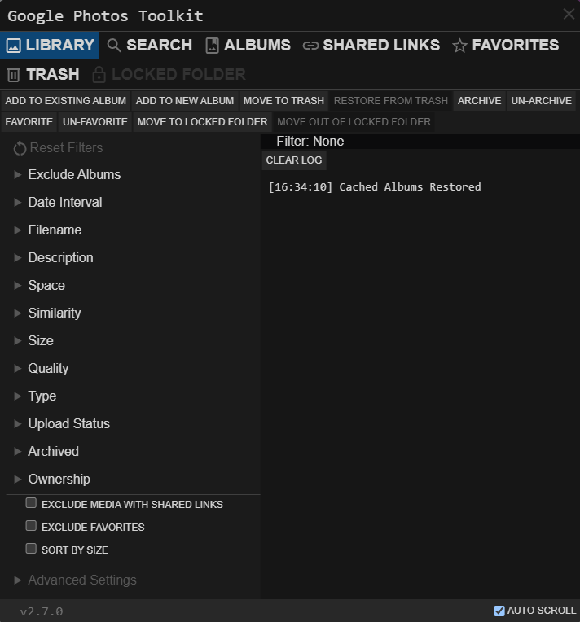

# Google Photos Toolkit

Bulk organize your media



## How It Works

In your browser, utilizing GP's undocumented web api

## How To Install

1. Install any recommended userscript manager for your browser

   - [Violentmonkey](https://violentmonkey.github.io/)
   - [Tampermonkey](https://www.tampermonkey.net/)
   - If you're on Android, try [Firefox](https://www.mozilla.org/firefox/browsers/mobile/android/) browser, it supports Tampermonkey

2. Click [Install](https://github.com/xob0t/Google-Photos-Toolkit/releases/latest/download/google_photos_toolkit.user.js)
3. Accept installation

## How to use

<details>
  <summary>Tutorial</summary>

1. Go to [photos.google.com](https://photos.google.com/) and click the GPTK icon in the top bar to open it

   

2. Select a source from which to read from:

   

3. Use Filters to filter found items with:

   

4. Select an action to apply to found items:

   

</details>

### Finding space-consuming media

This example groups all space-consuming media in one album.

1. Make sure "Library" is the selected source
2. Select `SPACE-CONSUMING` in the `Space` filter
3. Select action `Add to new album`

### Deleting all media in the library

As simple as selecting "Library" source, clicking `Move to trash`, then clearing it.

### Use GPTK's api

GPTK exports it's api class globally so you can use it in your browser's console.  
It's much more powerful than the UI!

Example usage.
Scan the whole library for media owned by `ownerName` and move it to trash if found.

```js
let nextPageId = null;
const ownerName = "John";
do {
  const page = await gptkApi.getItemsByUploadedDate(nextPageId);
  for (const item of page.items) {
    if (item.isOwned) continue;
    const itemInfo = await gptkApi.getItemInfoExt(item.mediaKey);
    console.log(`${item.mediaKey} is shared by ${itemInfo.owner.name}`);
    if (itemInfo.owner.name == ownerName) {
      await gptkApi.moveItemsToTrash([itemInfo.dedupKey]);
      console.log(`${item.mediaKey} moved to trash`);
    }
  }
  nextPageId = page.nextPageId;
} while (nextPageId);
console.log("DONE");
```

## Contributions welcome

If you want to learn more about how GP's api works, read https://kovatch.medium.com/deciphering-google-batchexecute-74991e4e446c  
I just found this post, after doing all the work from zero :D

Also, i've made a userscript that parses all responses and logs them to console in a more readable way, you can find it here - https://github.com/xob0t/Google-Photos-Toolkit/tree/main/tools

## BUGS

If something does not work, open an [issue](https://github.com/xob0t/Google-Photos-Toolkit/issues) and describe it in detail

If you have a question, open a [discussion](https://github.com/xob0t/Google-Photos-Toolkit/discussions)

## Credits

Borrowed some code and UI inspiration from [undiscord](https://github.com/victornpb/undiscord)

## My Other Google Photos Projects

- GP mobile python client: https://github.com/xob0t/gphotos_mobile_client
- Disguse any file as media for GP to accept and store it: https://github.com/xob0t/gp-file-hide

## ♥

If GPTK is useful to you, please consider supporting the project:

BTC `12znTocLytrrYhQT4AJVeJdR8KTULWbKb7`  
BTC Cash `qq7w48d6s3rddgxshl6ae48k7c5jyck76crvppqenn`  
DOGE `DQjBzT2qMuXkLMawUXG7umTf3k9VeT4Y6K`  
Etherium `0xcfe559D9F6056F82a6CFdEDA51c00132035955c8`  
Litecoin `ltc1qcgc873py5k28qm85sk5d53yfwzle4cztmvkh6l`
