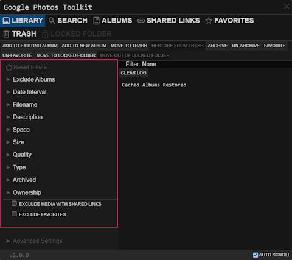

# Google Photos Toolkit
Bulk organize your media

## How It Works
In your browser, utilizing GP's undocumented web api

## How To Install
1. Install any recommended userscript manager for your browser
    * [Violentmonkey](https://violentmonkey.github.io/)
    * [Tampermonkey](https://www.tampermonkey.net/)
    * If you're on Android, try [Firefox](https://www.mozilla.org/firefox/browsers/mobile/android/) browser, it supports Tampermonkey

2. Click [Install](https://github.com/xob0t/Google-Photos-Toolkit/releases/latest/download/google_photos_toolkit.user.js)
3. Accept installation

## How to use

  
Tutorial

1. Go to [photos.google.com](https://photos.google.com/) and click the GPTK icon in the top bar to open it

    
2. Select a source from which to read from:

    
3. Use Filters to filter found items with:

    
4. Select an action to apply to found items:

    
  

## BUGS
If something does not work, open an [issue](https://github.com/xob0t/Google-Photos-Toolkit/issues) and describe it in detail

If you have a question, open a [discussion](https://github.com/xob0t/Google-Photos-Toolkit/discussions)

## Credits
Borrowed some code and UI inspiration from [undiscord](https://github.com/victornpb/undiscord)